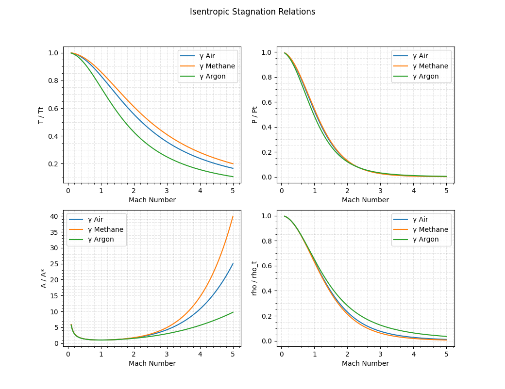

# gas dynamics

Gas Dynamics equations, table generators, oblique shock chart generators, and more.

To install with pip, use 

```
py -m pip install gas_dynamics
```

Equations, plots, and tables for solving compresible flow problems. Included are functions to solve problems relating to compressible flow, from stagnation relations to determining the mach number from changes in
local properties. Tables can be made for any gas and its respective ratio of specific heats, as well as plots and charts of relationships. 

All functions contain an argument to specify the fluid so as to obtain the appropriate ratio of specific heats and gas constant. If the fluid is not specified, the default argument is for air with a ratio of specific heats of 1.4 and a gas constant of 287 J / Kg K. Alternatively, if you want to specify the ratio of specific heats and gas constant directly, enter the values as a string preceded by a $. 

```
>>> import gas_dynamics as gd
>>> 
#Mach number after a normal shock for air
>>> M2 = gd.shock_mach(M1=1.25)
>>> M2
0.8126360553720011
>>>
#Mach number after a normal shock for argon
>>> M2 = gd.shock_mach(M1=1.25, gas='argon')
>>> M2
0.8184295177443512
>>> 
#Mach number for a user-defined fluid
>>> M2 = gd.shock_mach(M2=1.25, gas='$1.1,400')
>>> M2
0.803783189504693
>>>
```

Generate the isentropic flow tables for a range of Mach numbers and for a given gas.

```
>>> gd.stagnation_ratios(range=[.1,5], inc=.2, gas='nitrogen') 
Isentropic Flow Parameters for γ = 1.4
M: 0.100   |   P/Pt: 0.993    |    T/Tt: 0.998    |    A/A*: 5.822    |   rho/rho_t: 0.995
M: 0.300   |   P/Pt: 0.939    |    T/Tt: 0.982    |    A/A*: 2.035    |   rho/rho_t: 0.956
M: 0.500   |   P/Pt: 0.843    |    T/Tt: 0.952    |    A/A*: 1.340    |   rho/rho_t: 0.885
M: 0.700   |   P/Pt: 0.721    |    T/Tt: 0.911    |    A/A*: 1.094    |   rho/rho_t: 0.792
M: 0.900   |   P/Pt: 0.591    |    T/Tt: 0.861    |    A/A*: 1.009    |   rho/rho_t: 0.687
M: 1.100   |   P/Pt: 0.468    |    T/Tt: 0.805    |    A/A*: 1.008    |   rho/rho_t: 0.582
M: 1.300   |   P/Pt: 0.361    |    T/Tt: 0.747    |    A/A*: 1.066    |   rho/rho_t: 0.483
M: 1.500   |   P/Pt: 0.272    |    T/Tt: 0.690    |    A/A*: 1.176    |   rho/rho_t: 0.395
M: 1.700   |   P/Pt: 0.203    |    T/Tt: 0.634    |    A/A*: 1.338    |   rho/rho_t: 0.320
M: 1.900   |   P/Pt: 0.149    |    T/Tt: 0.581    |    A/A*: 1.555    |   rho/rho_t: 0.257
M: 2.100   |   P/Pt: 0.109    |    T/Tt: 0.531    |    A/A*: 1.837    |   rho/rho_t: 0.206 
M: 2.300   |   P/Pt: 0.080    |    T/Tt: 0.486    |    A/A*: 2.193    |   rho/rho_t: 0.165
M: 2.500   |   P/Pt: 0.059    |    T/Tt: 0.444    |    A/A*: 2.637    |   rho/rho_t: 0.132
M: 2.700   |   P/Pt: 0.043    |    T/Tt: 0.407    |    A/A*: 3.183    |   rho/rho_t: 0.106
M: 2.900   |   P/Pt: 0.032    |    T/Tt: 0.373    |    A/A*: 3.850    |   rho/rho_t: 0.085
M: 3.100   |   P/Pt: 0.023    |    T/Tt: 0.342    |    A/A*: 4.657    |   rho/rho_t: 0.069
M: 3.300   |   P/Pt: 0.017    |    T/Tt: 0.315    |    A/A*: 5.629    |   rho/rho_t: 0.056
M: 3.500   |   P/Pt: 0.013    |    T/Tt: 0.290    |    A/A*: 6.790    |   rho/rho_t: 0.045
M: 3.700   |   P/Pt: 0.010    |    T/Tt: 0.268    |    A/A*: 8.169    |   rho/rho_t: 0.037
M: 3.900   |   P/Pt: 0.008    |    T/Tt: 0.247    |    A/A*: 9.799    |   rho/rho_t: 0.030
M: 4.100   |   P/Pt: 0.006    |    T/Tt: 0.229    |    A/A*: 11.715    |   rho/rho_t: 0.025
M: 4.300   |   P/Pt: 0.004    |    T/Tt: 0.213    |    A/A*: 13.955    |   rho/rho_t: 0.021
M: 4.500   |   P/Pt: 0.003    |    T/Tt: 0.198    |    A/A*: 16.562    |   rho/rho_t: 0.017
M: 4.700   |   P/Pt: 0.003    |    T/Tt: 0.185    |    A/A*: 19.583    |   rho/rho_t: 0.015
M: 4.900   |   P/Pt: 0.002    |    T/Tt: 0.172    |    A/A*: 23.067    |   rho/rho_t: 0.012
M: 5.100   |   P/Pt: 0.002    |    T/Tt: 0.161    |    A/A*: 27.070    |   rho/rho_t: 0.010
```


Plotting Stagnation relations versus mach number for different gammas. Arguments are the mach number range, increment, and a list of gasses. Default valules are range = [.01, 5], inc=.1, and gasses = ['air','methane','argon']

```
plot_stgn_ratios()
```




All of the stagnation ratios are available, for example:
Return the area ratio required to accelerate a flow to M = 3 and the corresponding stagnation pressure and temperature ratio

```
>>> import gas_dynamics as gd
>>> A_Astar =gd.mach_area_ratio_choked(M=3)
>>> A_Astar
4.23456790123457
>>> p_pt = gd.stagnation_pressure_ratio(M=3)
>>> p_pt
0.027223683703862817
>>> Tt = gd.stagnation_temperature_ratio(M=3)
>>> Tt
0.35714285714285715
>>>
```


For the stagnation pressure and stagnation temperature relations, if two of the three necessary arguments are provided, the function will return the missing argument.

```
>>> pt = gd.stagnation_pressure(p=10, M=1)
>>> pt
18.92929158737854
>>> M = gd.stagnation_pressure(p=10, pt=pt)
>>> M
1.0
>>>
>>> Tt = gd.stagnation_temperature(T=300, M=1)
>>> Tt
360.0
>>> M = gd.stagnation_temperature(T=300, Tt=Tt)
>>> M 
1.0
```


Some miscellaneous valuable functions are also included to calculate flow rates or areas required for choked flow

```
>>> mdot = 5 #kg/s
>>> mdot_per_area = gd.choked_mdot(1000000, 300) #units are in Pascals
>>> mdot_per_area
2333.558560606226
>>> throat_area = mdot / mdot_per_area
>>> throat_area             #units are in meters squared
0.0021426503214477164
>>>
```


Determine the Mach # before and after a normal shock

```
>>> M2 = gd.shock_mach(M1=1.5) 
>>> M2
0.7010887416930995
>>> M1 = gd.shock_mach_before(M2)
>>> M1
1.4999999999999998
>>>
```

Generate the shock tables using

```
>>> gd.shock_tables(range=[1,2], inc=.1)
Normal Shock Parameters for γ = 1.4
M: 1.00   |   M2: 1.0000   |    p2/p1: 1.0000   |    T2/T1: 1.0000   |   dV/a: 0.0000   |   pt2/pt1: 1.000000
M: 1.10   |   M2: 0.9118   |    p2/p1: 1.2450   |    T2/T1: 1.0649   |   dV/a: 0.1591   |   pt2/pt1: 0.998928
M: 1.20   |   M2: 0.8422   |    p2/p1: 1.5133   |    T2/T1: 1.1280   |   dV/a: 0.3056   |   pt2/pt1: 0.992798
M: 1.30   |   M2: 0.7860   |    p2/p1: 1.8050   |    T2/T1: 1.1909   |   dV/a: 0.4423   |   pt2/pt1: 0.979374
M: 1.40   |   M2: 0.7397   |    p2/p1: 2.1200   |    T2/T1: 1.2547   |   dV/a: 0.5714   |   pt2/pt1: 0.958194
M: 1.50   |   M2: 0.7011   |    p2/p1: 2.4583   |    T2/T1: 1.3202   |   dV/a: 0.6944   |   pt2/pt1: 0.929787
M: 1.60   |   M2: 0.6684   |    p2/p1: 2.8200   |    T2/T1: 1.3880   |   dV/a: 0.8125   |   pt2/pt1: 0.895200
M: 1.70   |   M2: 0.6405   |    p2/p1: 3.2050   |    T2/T1: 1.4583   |   dV/a: 0.9265   |   pt2/pt1: 0.855721
M: 1.80   |   M2: 0.6165   |    p2/p1: 3.6133   |    T2/T1: 1.5316   |   dV/a: 1.0370   |   pt2/pt1: 0.812684
M: 1.90   |   M2: 0.5956   |    p2/p1: 4.0450   |    T2/T1: 1.6079   |   dV/a: 1.1447   |   pt2/pt1: 0.767357
M: 2.00   |   M2: 0.5774   |    p2/p1: 4.5000   |    T2/T1: 1.6875   |   dV/a: 1.2500   |   pt2/pt1: 0.720874

```

Extremely useful in solving flow deflection problems are the oblique shock charts, so those are provided. For more precise solutions, equation solvers are embedded in the functions to find the exact values for the strong and weak shock solutions.

```
gd.shock_oblique_charts()
```


```
>>> deflect = gd.shock_flow_deflection(M=2, theta = 22.5)
>>> deflect
-10.856560004139958
```

Get the strong and weak shock solution for a flow deflection

```
>>> shocks = gd.shock_angle(M=2, dirac = -10) 
>>> shocks
[23.014012220565785, 96.29991962425305]
>>> 
```

Solve for the Mach number

```
>>> M = gd.shock_mach_given_angles(theta=22.5, dirac=10) 
>>> M
3.9293486839798955
>>>
```
