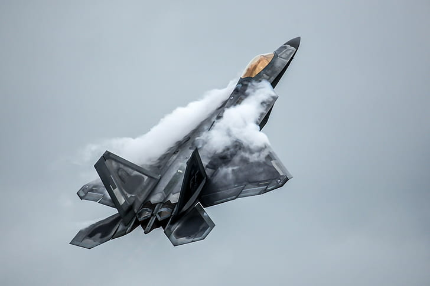
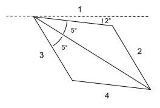

##############
Worked Example
##############

   Credits: F-22 Demonstration Team

The mighty F-22 raptor is traveling at its supercruise speed of Mach 1.8 when it turns up at an angle of 7 degrees. The airfoil can be modeled as a symmetrical rhombus with 5 degree half angles as pictured below. Calculate the Mach numbers on surface 1, 2, 3, and 4.

**Solution**

From the figure we come to the conclusion that we will have Prandtl-Meyer expansion fans from the freestream to surface 1, and from surface 1 to surface 2. Using the functions `prandtl_meyer_angle_from_mach` and `prandtl_meyer_mach_from_angle`, we can get the Mach number information pretty quickly.

.. code-block:: python

   >>> import gas_dynamics as gd
   >>> mach_initial = 1.8
   >>> angle_init = gd.prandtl_meyer_angle_from_mach(mach_initial)
   >>> angle_init
   20.72506424776447
   >>> angle_surface_1 = angle_init + 2
   >>> mach_surface_1 = gd.prandtl_meyer_mach_from_angle(angle_surface_1)
   >>> mach_surface_1
   1.869672760055039
   >>> angle_surface_2 = angle_surface_1 + 10
   >>> mach_surface_2 = gd.prandtl_meyer_mach_from_angle(angle_surface_2)
   >>> mach_surface_2
   2.2385201020582
   >>>

We can also get the corresponding pressures on these surfaces using `pressure_from_mach_ratio`

.. code-block:: python

   >>> pressure_initial = 1
   >>> pressure_surface_1 = gd.pressure_from_mach_ratio(pressure_initial=pressure_initial, mach_initial=mach_initial, mach_final=mach_surface_1)
   >>> pressure_surface_1
   0.8985710141625418
   >>> pressure_surface_2 = gd.pressure_from_mach_ratio(pressure_initial=pressure_surface_1, mach_initial=mach_surface_1, mach_final=mach_surface_2)
   >>> pressure_surface_2
   0.5059159131613694
   >>>

For surfaces 3 and 4, we notice that we will first have a shock as the flow is turning into itself, followed by another Prandtl-Meyer expansion from surface 3 to 4.  Before proceeding with shock case, lets import the sine function that works in degrees from the "extra" module.

.. code-block:: python

   >>> from gas_dynamics.extra import sind
   >>> shock_angle = gd.shock_angle(mach=mach_initial, flow_deflection=12)
   >>> shock_angle
   [46.685991854146, 80.21459032863389]
   >>> mach_initial_normal = mach_initial * sind(shock_angle[0])
   >>> mach_initial_normal
   1.3096891104605881
   >>> mach_surface_3_normal = gd.shock_mach(mach_initial_normal)
   >>> mach_surface_3_normal
   0.7810840690884703
   >>> mach_surface_3 = mach_surface_3_normal / sind(shock_angle[0] - 12)
   >>> mach_surface_3
   1.3725418664628979

We conclude with the final Prandtl-Meyer expansion from surface 3 to 4.

.. code-block:: python

   >>> angle_surface_3 = gd.prandtl_meyer_angle_from_mach(mach_surface_3)
   >>> angle_surface_4 = angle_surface_3 + 10
   >>> mach_4 = gd.prandtl_meyer_mach_from_angle(angle_surface_4)
   >>> mach_4
   1.7132972931071317
   >>>