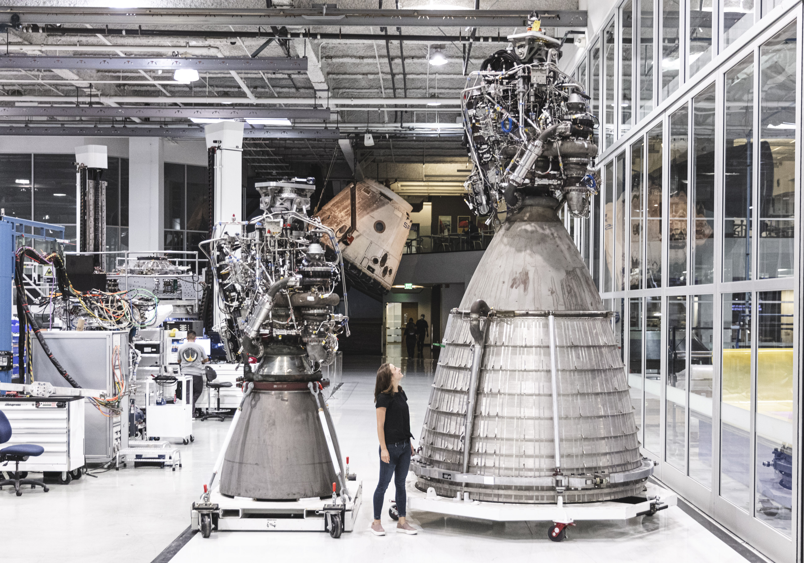
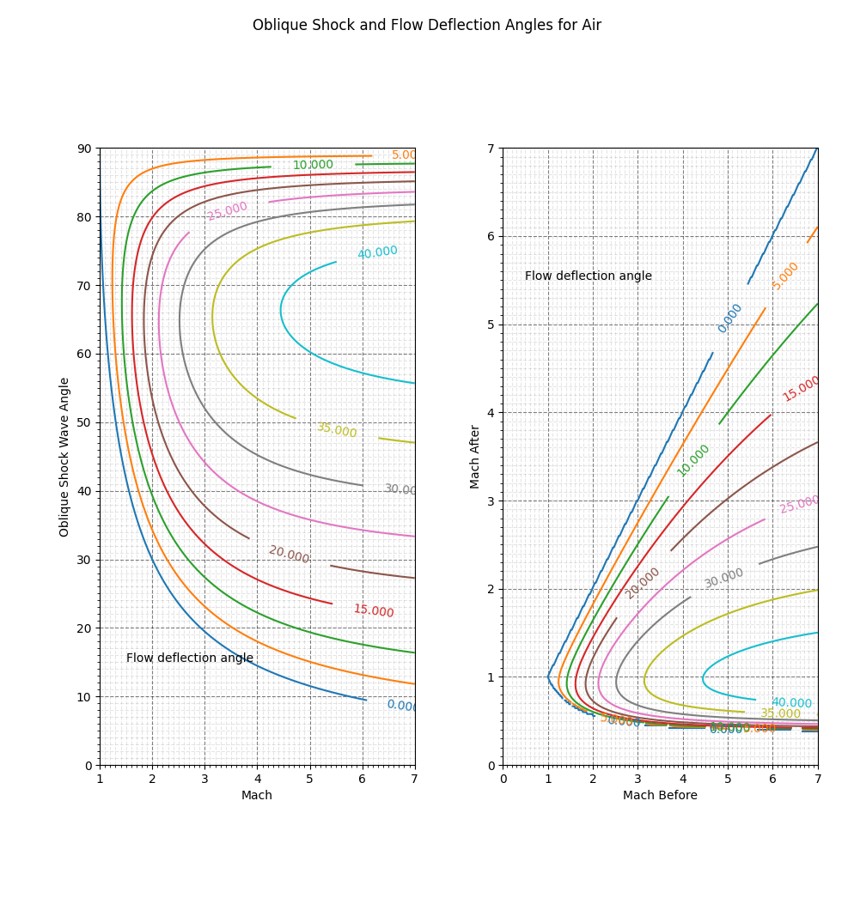

##############
Worked Example
##############

   Credits: SpaceX 

Elon Musk wants to test a vacuum optimized nozzle for the raptor engine. He gives you a call and wants to know two things - if the nozzle is tested at sea level, will the shock occur inside or outside the nozzle, and if outside what is the shock angle? You are told the nozzle expansion ratio is around 100 and that the chamber pressure will be 300 bar.

**Solution**

Let us gather the few knowns we have and then determine a couple of things, those being our exit mach number, the stagnation pressure ratio required to satisfy that exit mach number, and the stagnation pressure ratio that actually exists. Additionally we will assume there will be no flow separation along the nozzle.

Knowns:
 - :math:`p_{t}\,=\,300\,bar`
 - :math:`p_{ambient}\,=\,1\,bar`
 - :math:`\frac{A}{A^*}\,=\,100`

.. code-block:: python

   >>> import gas_dynamics as gd
   >>> pt, p_ambient, area_ratio = 300, 1, 100
   >>> machs = gd.mach_from_area_ratio(area_ratio)
   >>> machs
   [0.005787153326509106, 6.936290389823407]
   >>> exit_mach = machs[1]
   >>> pressure_ratio_required = gd.stagnation_pressure_ratio(mach=exit_mach)
   >>> pressure_ratio_required
   0.00025598655808268633
   >>> pressure_ratio_actual = p_ambient/pt
   >>> pressure_ratio_actual
   0.0033333333333333335

Let's talk about some of these findings. We use the function `mach_from_area_ratio` to determine the possible exit mach numbers given the area ratio and choose the solution for the supersonic case. Using this mach number, we can determine the stagnation pressure ratio required between the combustion chamber and a flow that has been accelerated to mach = 6.93, this ratio being extraordinarily low at 0.00025. Next we determine the pressure ratio that actually exists between the chamber and the atmosphere, 0.0033. Since the pressure ratio that exists is greater than the one required, it seems a compression process will take place, that compression process being a shock. 

Now that we know there will be a shock, let's determine the pressure ratio required to form a shock at the nozzle exit plane (the second critical) and the pressure ratio for our current operating conditions. Comparing these two pressure ratios will tell us whether the shock occurs inside or outside the nozzle.

.. code-block:: python

   >>> presure_ratio_normal_shock = gd.shock_pressure_ratio(exit_mach)
   >>> presure_ratio_normal_shock
   55.96414510061599
   >>>
   >>> p2_p1_shock = pressure_ratio_actual/pressure_ratio_required
   >>> p2_p1_shock
   13.021517060503747

A normal shock at the exit is way too strong of a compresion process, so we conclude an oblique shock forms outside of the nozzle. We finish by determining the angle and the deflection of the streamline across the shock as well as the mach number of the turned flow.

.. code-block:: python

   >>> mach_1_normal = gd.shock_mach_from_pressure_ratio(p2_p1_shock)
   >>> mach_1_normal
   3.3621655938445065

Now that we have the *normal* component of the mach number, we rearrange the following equation to get the angle of the shock.

.. math::

   M_{1n} = M_{1} \sin(\theta)
   
   \theta = \sin^{-1} \left( \frac{M_{1n}}{M_{1}} \right)

Because `numpy` doesn't have sine and cosine equations that output in degrees, they are included in the gas dynamics package, but not loaded to the namespace by default.

.. code-block:: python

   >>> from gas_dynamics.extra import arcsind, sind
   >>> theta = arcsind(mach_1_normal/exit_mach)
   >>> theta
   28.994194516386344
   >>> flow_deflection = gd.shock_flow_deflection(mach=exit_mach, shock_angle=theta)
   >>> flow_deflection
   21.406144308820586
   >>> mach_2_normal = gd.shock_mach(exit_mach)
   >>> mach_2_normal
   0.3977097831025341
   >>> mach_2 = mach_2_normal / (sind(theta - flow_deflection))
   >>> mach_2
   3.011819904141924
   >>> gd.shock_oblique_charts(mach_max = 7, dark=False, points = 100000)
   100% complete

Our analytical results line up with the plots. The shock occurs outside the nozzle, the shock angle is around 29 degrees, the flow is deflected 21 degrees, and the mach number after the flow is turned is around 3.01. Let's give Elon a call and head home!