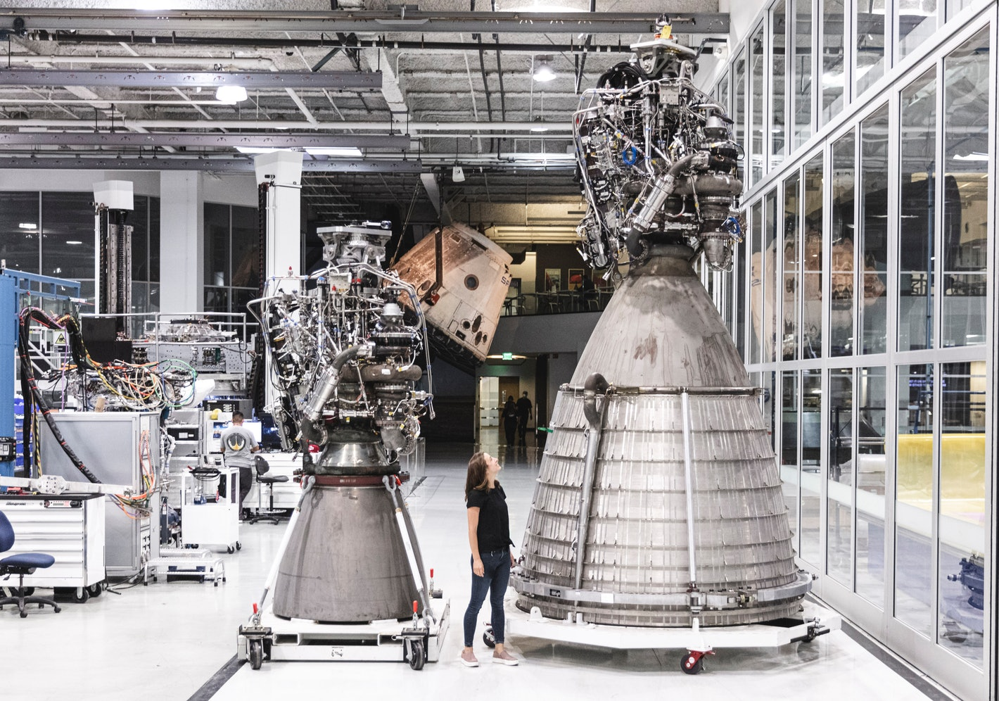

###############
Worked Examples
###############

   Credits: SpaceX 

Elon Musk wants to test a vacuum optimized nozzle for the raptor engine. He gives you a call and wants to know two things - if the nozzle is tested at sea level, will the shock occur inside or outside the nozzle, and if outside what is the shock angle? You are told the nozzle expansio ratio is around 100 and that the chamber pressure will be 300 bar.

**Solution**