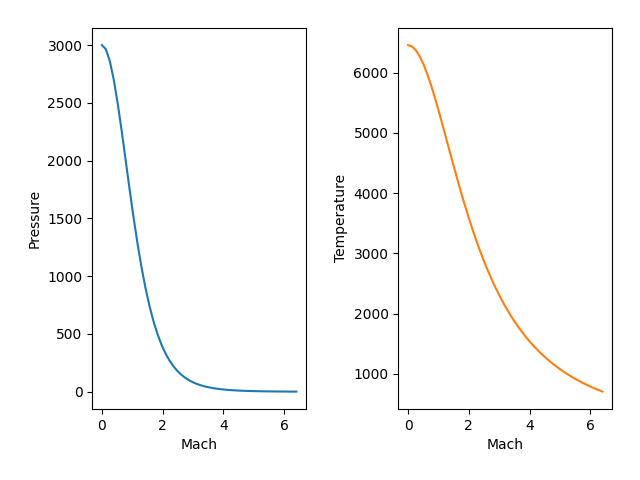

##############
Worked Example
##############

.. figure:: ssme.png
   :width: 800
   :alt: SSME in a static fire 

   Credits: NASA Images

The year is 1970. You are an eager, young, bright eyed engineer working at Aerojet Rocketdyne tasked with designing the nozzle for the Space Shuttle main engine, the RS-25. The design team is not sure when or where maximum dynamic pressure will occur, so to play it safe they decide that all engines (and consequently, their nozzles) should be operating ideally at around 55,000 ft above sea level where the air pressure is approximately 1.3 psi. Additionally you know that the combustion chamber temperature and pressure are 6000 Fahrenheit and 3000 psi. You are asked to deliver several items:

 - The exit Mach number.
 - The area ratio.
 - The maximum flow rate per unit area (mass flux), and the areas and diameters of the throat and exit, given a flowrate of 1100 lbm/s.
 - A plot of position in the nozzle versus temperature and pressure to deliver to the thermal and structural engineers.

**Solution**

Let us assume the fluid velocity inside the chamber is non-moving and therefore is at stagnation temperature and pressure, :math:`T_{t}=6000\,^{\circ}F`, and :math:`p_{t}=3000\,psi`. Assuming that our nozzle is functioning ideally, we also know what the ratio of stagnation pressures from the chamber to the throat and from the throat to the nozzle exit is unity. We come to the following conclusion.

.. math::
    
    \frac{p_{air}}{p_{t}} = \frac{1.3}{3000} = .000433

There are a couple of ways to go about this. We generate a coarse view of the tables (because we are feeling nostalgic and old school) and seek the Mach number that corresponds to the stagnation pressure ratio.

.. code-block:: python

    >>> import gas_dynamics as gd
    >>> gd.stagnation_ratio_table([1,8], step=.2)
    Isentropic Flow Parameters for Air, γ = 1.4
    M: 1.000   |   P/Pt: 0.52828    |    T/Tt: 0.8333    |    A/A*: 1.000    |   rho/rho_t: 0.634
    M: 1.200   |   P/Pt: 0.41238    |    T/Tt: 0.7764    |    A/A*: 1.030    |   rho/rho_t: 0.531
    M: 1.400   |   P/Pt: 0.31424    |    T/Tt: 0.7184    |    A/A*: 1.115    |   rho/rho_t: 0.437
    M: 1.600   |   P/Pt: 0.23527    |    T/Tt: 0.6614    |    A/A*: 1.250    |   rho/rho_t: 0.356
    M: 1.800   |   P/Pt: 0.17404    |    T/Tt: 0.6068    |    A/A*: 1.439    |   rho/rho_t: 0.287
    M: 2.000   |   P/Pt: 0.12780    |    T/Tt: 0.5556    |    A/A*: 1.688    |   rho/rho_t: 0.230
    M: 2.200   |   P/Pt: 0.09352    |    T/Tt: 0.5081    |    A/A*: 2.005    |   rho/rho_t: 0.184
    M: 2.400   |   P/Pt: 0.06840    |    T/Tt: 0.4647    |    A/A*: 2.403    |   rho/rho_t: 0.147
    M: 2.600   |   P/Pt: 0.05012    |    T/Tt: 0.4252    |    A/A*: 2.896    |   rho/rho_t: 0.118
    M: 2.800   |   P/Pt: 0.03685    |    T/Tt: 0.3894    |    A/A*: 3.500    |   rho/rho_t: 0.095
    M: 3.000   |   P/Pt: 0.02722    |    T/Tt: 0.3571    |    A/A*: 4.235    |   rho/rho_t: 0.076
    M: 3.200   |   P/Pt: 0.02023    |    T/Tt: 0.3281    |    A/A*: 5.121    |   rho/rho_t: 0.062
    M: 3.400   |   P/Pt: 0.01512    |    T/Tt: 0.3019    |    A/A*: 6.184    |   rho/rho_t: 0.050
    M: 3.600   |   P/Pt: 0.01138    |    T/Tt: 0.2784    |    A/A*: 7.450    |   rho/rho_t: 0.041
    M: 3.800   |   P/Pt: 0.00863    |    T/Tt: 0.2572    |    A/A*: 8.951    |   rho/rho_t: 0.034
    M: 4.000   |   P/Pt: 0.00659    |    T/Tt: 0.2381    |    A/A*: 10.719    |   rho/rho_t: 0.028
    M: 4.200   |   P/Pt: 0.00506    |    T/Tt: 0.2208    |    A/A*: 12.792    |   rho/rho_t: 0.023
    M: 4.400   |   P/Pt: 0.00392    |    T/Tt: 0.2053    |    A/A*: 15.210    |   rho/rho_t: 0.019
    M: 4.600   |   P/Pt: 0.00305    |    T/Tt: 0.1911    |    A/A*: 18.018    |   rho/rho_t: 0.016
    M: 4.800   |   P/Pt: 0.00239    |    T/Tt: 0.1783    |    A/A*: 21.264    |   rho/rho_t: 0.013
    M: 5.000   |   P/Pt: 0.00189    |    T/Tt: 0.1667    |    A/A*: 25.000    |   rho/rho_t: 0.011
    M: 5.200   |   P/Pt: 0.00150    |    T/Tt: 0.1561    |    A/A*: 29.283    |   rho/rho_t: 0.010
    M: 5.400   |   P/Pt: 0.00120    |    T/Tt: 0.1464    |    A/A*: 34.175    |   rho/rho_t: 0.008
    M: 5.600   |   P/Pt: 0.00096    |    T/Tt: 0.1375    |    A/A*: 39.740    |   rho/rho_t: 0.007
    M: 5.800   |   P/Pt: 0.00078    |    T/Tt: 0.1294    |    A/A*: 46.050    |   rho/rho_t: 0.006
    M: 6.000   |   P/Pt: 0.00063    |    T/Tt: 0.1220    |    A/A*: 53.180    |   rho/rho_t: 0.005
    M: 6.200   |   P/Pt: 0.00052    |    T/Tt: 0.1151    |    A/A*: 61.210    |   rho/rho_t: 0.004
    M: 6.400   |   P/Pt: 0.00042    |    T/Tt: 0.1088    |    A/A*: 70.227    |   rho/rho_t: 0.004
    M: 6.600   |   P/Pt: 0.00035    |    T/Tt: 0.1030    |    A/A*: 80.323    |   rho/rho_t: 0.003
    M: 6.800   |   P/Pt: 0.00029    |    T/Tt: 0.0976    |    A/A*: 91.594    |   rho/rho_t: 0.003
    M: 7.000   |   P/Pt: 0.00024    |    T/Tt: 0.0926    |    A/A*: 104.143    |   rho/rho_t: 0.003
    M: 7.200   |   P/Pt: 0.00020    |    T/Tt: 0.0880    |    A/A*: 118.080    |   rho/rho_t: 0.002
    M: 7.400   |   P/Pt: 0.00017    |    T/Tt: 0.0837    |    A/A*: 133.520    |   rho/rho_t: 0.002
    M: 7.600   |   P/Pt: 0.00014    |    T/Tt: 0.0797    |    A/A*: 150.585    |   rho/rho_t: 0.002
    M: 7.800   |   P/Pt: 0.00012    |    T/Tt: 0.0759    |    A/A*: 169.403    |   rho/rho_t: 0.002
    M: 8.000   |   P/Pt: 0.00010    |    T/Tt: 0.0725    |    A/A*: 190.109    |   rho/rho_t: 0.001

On second thought, let us be a little more precise and get the *exact* Mach number. From the table, we are expecting something around Mach = 6.4, and then an area ratio around 70.

.. code-block:: python

    >>> M_exit = gd.mach_from_pressure_ratio(pressure_initial=3000, pressure_final=1.3,mach_initial=0)
    >>> M_exit
    6.379339932707969
    >>> A_Astar = gd.mach_area_star_ratio(M_exit)
    >>> A_Astar
    69.24755332876032
    >>>

.. math::

    M_{exit} = 6.379
    
.. math::
    \frac{A}{A*} = 69.25

We got something! Cool. Now lets tackle the nozzle area. Knowing that our flowrate is 1100 lbm/s, lets solve for :math:`\frac{\dot{m}}{A*}` and then divide out flowrate to get A*. Lets double check the function inputs while we're here.

.. code-block:: python

    >>> help(gd.mass_flux_max)
    Help on function mass_flux_max in module gas_dynamics.standard.standard:

    mass_flux_max(stagnation_pressure: float, stagnation_temperature: float, gas=<gas_dynamics.fluids.fluid object at 0x00000240BB661D60>) -> float
        Returns the maximum flow rate per unit choked area

        Notes
        -----
        Given stagnation pressure, stagnation temperature, and the fluid,
        return the flow rate for a Mach number equal to 1. Default fluid
        is air.

        **Units**:

        J / kg-K and Pa return kg/m^2

        kJ / kg-K and kPa returns kg/m^2

        ft-lbf / lbm-R and psi returns lbm/in^2

        Parameters
        ----------
        stagnation_pressure : `float`
            The stagnation pressure.

        stagnation_temperature : `float`
            The stagnation temperature.

        gas : `fluid`
            A user defined fluid object. Default is air

        metric : `bool`
            Use metric or US standard.

        Returns
        -------
        float
            The maximum mass flux

It looks like our output is going to be in lbm/in^2. Our temperature should also be in Rankine instead of Fahrenheit, and we should be using air with the US standard properties.

.. code-block:: python

    >>> from gas_dynamics.fluids import air_us
    >>> Temp_rankine = 6000 + 459.67
    >>> chamber_pressure = 3000
    >>> mdot = 1100
    >>> flux = gd.mass_flux_max(stagnation_pressure=chamber_pressure, stagnation_temperature=Temp_rankine, gas=air_us)
    >>> flux
    19.857532983568127
    >>> throat_area = flux**-1 * 1100
    >>> throat_diameter = (throat_area*4/3.14159)**.5
    >>> exit_area = A_Astar*throat_area
    >>> exit_diameter = (exit_area*4/3.14159)**.5
    >>> throat_area, throat_diameter
    (55.394595134765076, 8.398252714991807)
    >>> exit_area, exit_diameter
    (3835.9401807197314, 69.88615638831808)
    >>>

Let us reflect on some these results:

.. math::

    \frac{\dot{m}}{A^*} = 19.857\,{{lbm}/{in^2}}

.. math::

    A^* = 55.39\,{in}^2

.. math::

    d_{throat} = 8.39\,{in}

.. math::

    A_{exit} = 3835.94\,{in}^2

.. math::

    d_{exit} = 69.88\,{in}

At a temperature and pressure of 6459.67 Rankine and 3000 psi, the RS-25 will be pushing around 20 pound masses of combustion gases through a square inch every second. The throat needs to be approximately 8 inches diameter and the nozzle exit needs to be around 70 inches diameter in order to accelerate our fluid to the design Mach number.

Finally, lets make those plots.

.. code-block:: python

    >>> import matplotlib as plt
    >>> import numpy as np
    >>> machs = np.linspace(0,6.4,100)
    >>> pressures=[]
    >>> temperatures=[]
    >>> for m in machs:
            pressures.append(gd.stagnation_pressure(stagnation_pressure=3000,mach=m))
            temperatures.append(gd.stagnation_temperature(stagnation_temperature=6459.67,mach=m))
    >>>
    >>> fig, (ax1,ax2) = plt.subplots(1,2)
    >>> ax1.plot(machs,pressures,color='tab:blue')
    >>> ax1.set_xlabel('Mach')
    >>> ax1.set_ylabel('Pressure')
    >>> ax2.plot(machs,temperatures,color='tab:orange')
    >>> ax2.set_xlabel('Mach')
    >>> ax2.set_ylabel('Temperature')
    >>> fig.tight_layout(pad=2.0)
    >>> plt.show()

We observe that the pressure and temperature sink quite drastically as we progress and accelerate through the nozzle. The structural engineer can take the day off but it looks like the thermal engineer has quite a lot of work to do to find out ways to cool the nozzle.

